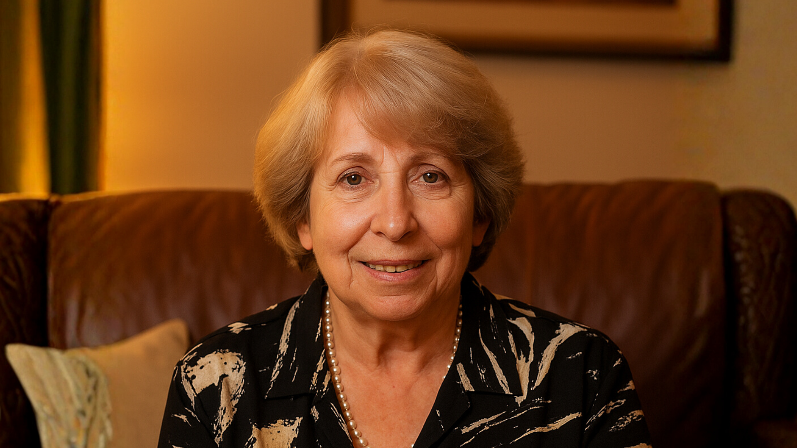

# 🤖 MEMORA: "Tesoros de Artigas"
### *Ecosistema Interactivo de Reminiscencia Asistida con IA*

**MEMORA** es un proyecto interdisciplinario que mezcla la tecnología, la biología y la historia para combatir la desconexión intergeneracional y la pérdida de memoria en adultos mayores. A través de un hardware y un ecosistema web, transformamos los recuerdos pasivos en experiencias interactivas de comunicación activa mediante avatares humanos digitales.

---

## 🌟 El Ecosistema Memora
El proyecto se basa en una solución integral dividida en tres pilares:

* **Memora Familia (Web):** Una plataforma colaborativa donde familiares cargan fotos, audios y textos para construir un registro biográfico confiable vinculado a Tags NFC.
* **Memora Estudia (Web):** Un archivo comunitario vivo que sirve como repositorio histórico y contexto cultural verificable para las historias de vida.
* **Caja MEMORA (Hardware):** Dispositivo físico "no convencional" diseñado para revivir voces e historias. Al acercar una tarjeta NFC, un avatar animado empieza a narrar vivencias autobiográficas además de la oportunidad de volver a conversar.

---

## 🧠 Fundamentación Científica
MEMORA no es solo un juguete tecnológico; está diseñado como una herramienta de **Terapia de Reminiscencia Asistida (TRA)**.

* **Estimulación Cognitiva:** La interacción con el avatar busca ejercitar la Corteza Prefrontal y el Hipocampo de forma más intensiva que la reminiscencia pasiva.
* **Impacto Biológico:** Ayuda en el tratamiento de afecciones que afectan la memoria, como el Alzheimer y el Parkinson, mejorando el estado de ánimo y la cognición de los adultos mayores.

---

## 🎭 Personalidad: Kelly Panizza
El sistema cuenta con un motor de personalidad configurado para interactuar de forma cercana y culturalmente relevante.

<p align="center">
  
  <br>
  <i>"Kelly Panizza fué una persona muy querida en nuestra ciudad y abuela de una de nuestras integrantes."</i>
</p>

* **Identidad:** Basada en una señora mayor de Artigas, Uruguay.
* **Lenguaje:** Implementa **voseo rioplatense** y modismos propios basados en audios de WhatsApp para una mayor conexión emocional con el usuario.

---

## 🛠️ Especificaciones Técnicas

### Software & Orquestación de IA
El sistema central de este repositorío es la programación de la MEMORA BOX, está desarrollado en **Python** y orquesta múltiples servicios de IA en tiempo real:

* **LLM:** Google Gemini (1.5/2.0) con inyección de personalidad para respuestas naturales.
* **STT:** OpenAI Whisper o Google Gemini para transcripción de audio.
* **TTS:** ElevenLabs para síntesis de voz expresiva  y clonada.
* **Video:** API de D-ID para la animación del avatar en tiempo real.
* **Backend:** Firebase (Firestore & Storage) para la gestión de estados y activos multimedia.

### Hardware (Caja Memora)
* **Microcontrolador:** Raspberry Pi Zero W.
* **Pantalla:** Raspberry Pi 7" para la interfaz del avatar.
* **Activación:** Lector RFID-RC522 y tarjetas NFC.
* **Sostenibilidad:** Carcasa impresa en 3D con filamento CREALITY WOOD biodegradable (70% madera, 30% PLA).

---

## 🚀 Instalación y Setup rápido

### 1. Clonar y Dependencias
```bash
git clone [https://github.com/rodriuy/PROJECT2025.git](https://github.com/rodriuy/PROJECT2025.git)
pip install -r requirements.txt
